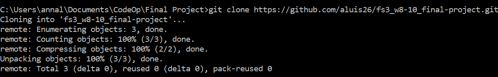

# Methodology Github

## Step 1

Fork the original project into your local repo and clone the document in your local.

## Step 2

Add a new remote to your local repo, this way you will have access to both of the remotes, the original and your fork.
In this case, we call the new remote upstream. The branch stagging in the upstream remote will be the one used to commit the contributions.

Now, the project is linked to two remotes, your fork and the original upstream:

## Step 3

Work in your fork and commit the changes to it. When having something enough relevant to push into the upstream repository follow the next steps:

1.Pull the state of the upstream repostory stagging branch and merge with your changes in your local:  
2.Push the merged state into your fork:  
3.Request a pull from to the upstream repository and wait for the approval to merge your contribution into the upstream stagging branch:  

